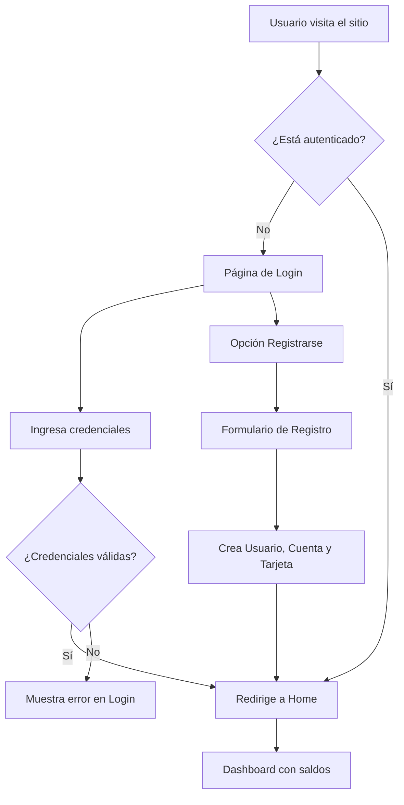

# Diagrama de Flujo y Lógica de Alke Wallet

Este documento describe los flujos de usuario y la lógica de negocio principal de la aplicación.

## 1. Flujo de Autenticación

## 2. Flujo de Transferencia

1.  **Inicio:** El usuario hace clic en "Transferir" desde el Dashboard.
2.  **Vista:** Se muestra la página de transferencias con dos secciones:
    *   **Izquierda:** Formulario para ingresar los datos de la transferencia.
    *   **Derecha:** Lista de contactos guardados con botones (Usar, Editar, Eliminar).
3.  **Acción del Usuario (Opción A - Manual):**
    *   Rellena el formulario con los datos del destinatario y el monto.
4.  **Acción del Usuario (Opción B - Usando Contacto):**
    *   Hace clic en "Usar" en un contacto de la lista.
    *   JavaScript rellena automáticamente los campos del formulario.
5.  **Envío:** El usuario hace clic en "Transferir".
6.  **Lógica de Backend (`withdraw_funds` en `Account`):**
    *   **Verifica Saldo:** ¿El `monto` es menor o igual al `balance` de la cuenta corriente?
        *   **Sí:** Se resta el `monto` del `balance`.
        *   **No:** Se calcula el `déficit` (`monto` - `balance`).
            *   **Verifica Línea de Crédito:** ¿El `déficit` es menor o igual al `credit_line_available`?
                *   **Sí:** El `balance` de la cuenta se establece en 0 y el `déficit` se suma al `credit_line_usage`. Se genera una **alerta** para el usuario.
                *   **No:** Se lanza una excepción de `ValidationError` ("Saldo insuficiente").
7.  **Resultado:**
    *   **Éxito:** Se crea un nuevo registro en el modelo `Transaction` y se redirige al Home con un mensaje de éxito (y la alerta si se usó la línea de crédito).
    *   **Fallo:** Se muestra un mensaje de error en la misma página.

## 3. Flujo de Depósito

1.  **Inicio:** El usuario hace clic en "Depositar".
2.  **Acción:** Rellena el formulario con el monto y el origen.
3.  **Lógica de Backend (`deposit` en `Account`):**
    *   **Verifica Deuda:** ¿El `credit_line_usage` es mayor a 0?
        *   **Sí:** El monto del depósito se usa para pagar la deuda.
            *   Si el depósito cubre toda la deuda, el sobrante (`remainder`) se suma al `balance` de la cuenta corriente.
            *   Si el depósito no cubre la deuda, simplemente se resta del `credit_line_usage`.
        *   **No:** El monto completo se suma al `balance` de la cuenta corriente.
4.  **Resultado:** Se crea un registro `Transaction` y se redirige al Home.

## 4. Flujo de Pago de Servicios

1.  **Inicio:** El usuario va a "Pago de Servicios".
2.  **Acción:** Selecciona la empresa, el monto y el **método de pago**.
3.  **Lógica de Frontend (JavaScript):**
    *   Si el método de pago es "Tarjeta de Crédito", se muestra el campo "Cuotas".
    *   Si es "Cuenta Corriente", el campo "Cuotas" se oculta y deshabilita.
4.  **Lógica de Backend:**
    *   **Si es Cuenta Corriente:** Llama a la misma lógica de `withdraw_funds` del flujo de transferencia.
    *   **Si es Tarjeta de Crédito:** Verifica si el `monto` es menor o igual al `national_available`. Si es así, el `monto` se suma al `national_balance` (aumenta la deuda).
5.  **Resultado:** Se crea la transacción y se redirige al Home.